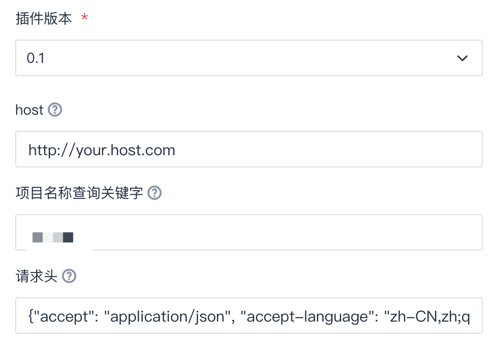

# 统一角色插件

## 新建插件

1. 团队管理/持续集成/构建插件
2. 新建构建插件
3. 上传压缩包
4. 发布插件

## 更新插件

步骤与新建插件相同

## 使用插件

在构建计划中使用，如下图：

如何获取headers?
在Chrome浏览器，登录到CODING中，右键“检查”,刷新页面，找到任何一个接口，“Copy as Node.js fetch”，将headers的内容拿出来。

如何序列化haders？
打开default.py文件，将浏览器拿到的headers的值，赋给default_headers，然后执行default.py文件即可。

## 参数说明

1. host：CODING服务地址主机部分，http开头。非必填，如果为空，从default.py中获取default_host的值。
2. keyword：项目名称关键字，如果为空，则查询所有项目。如果只改一个项目，此处填写项目名称。
3. headers：http请求的headers。非必填，如果为空，从default.py中获取default_headers的值。

## 角色维护

修改config.py文件进行维护。角色对应的权限描述请务必与页面上的权限保持一致。

## 权限维护

修改roles.py文件，维护每个权限对应的具体值。可在页面上修改权限，保存时查看请求参数。