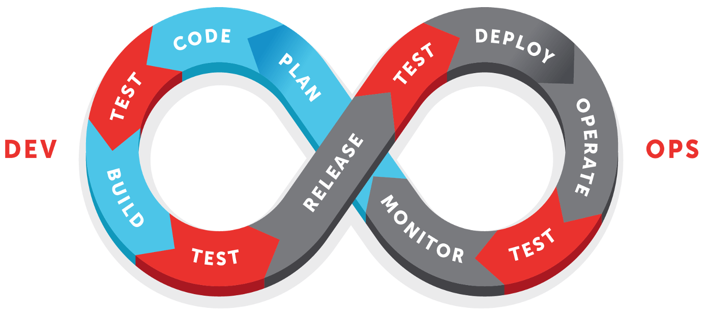
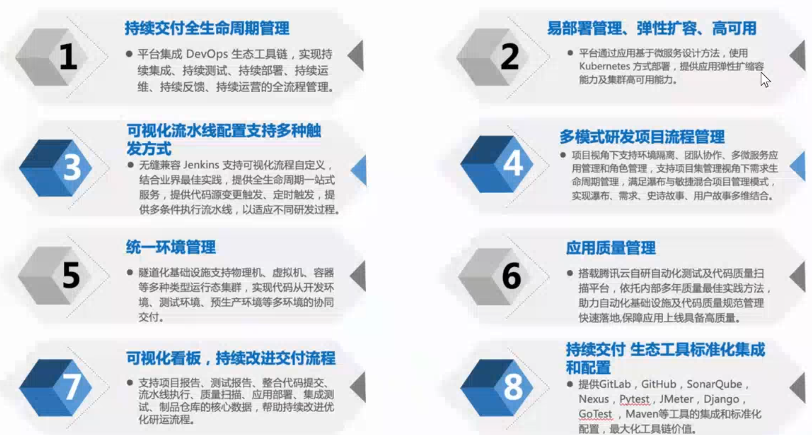

# DevOps相关概念

## DevOps

常见的理解方式：

1. DevOps = Dev + Ops（老虎，狮子，看板...）
2. DevOps = 人（文化建设）+ 流程（标准与规范建设）+ 工具（工具链建设）
3. DevOps = Dev + Testing + Security + Ops
4. DevOps = 项目协同 + 持续集成(CI) + 持续交付(CD) + 持续部署(CD) + 持续运营(CO)
5. DevOps = 快速、高质量交付高价值的软件产品

### 莫比乌斯环型流水线

[莫比乌斯带-走不完的轮回](https://www.zhihu.com/question/23689080)

### 自组织

## CI

持续集成

## CD

### 持续交付

### 持续部署

## CO

持续运营

## 持续反馈

## 持续测试

## 持续看板

## 持续改进

## 敏捷

### Scrum

#### Epic

#### Backlog

#### Story

#### Task

#### 缺陷

defect

#### Sprint

## Kanban

看板管理，来自日语“看板”，日语罗马拼写：Kanban，是丰田生产模式中的重要概念，指为了达到准时生产方式（JIT）控制现场生产流程的工具。

## lean

精益

1. 严格（无情）减少浪费，包括流程、文档、人员......

## MVP

## 站会

## 数字化转型

## 学习型组织

## 双模IT

### 稳态

稳态只是过渡

### 敏态

敏态才是最终

## 测试

### 测试左移

### 测试右移

## 质量

### 质量合规

### 质量门禁

### 质量红线

### Code Review

## 环境

### Dev/Test

### SIT

### UAT

### PROD

## Operation

### CMDB

### 运维看板

## CMMI

## ITSM

## 度量

### 关注的度量指标

部署成功率
部署频率

构建时长
构建成功率
部署时长
部署前置时间
部署成功率
部署频率
故障恢复时间

需求交付周期
交付吞吐率
单元测试覆盖率
缺陷密度
缺陷漏测率
严重缺陷率
代码安全漏洞
第三方开源安全漏洞

需求颗粒度
分支生命周期
需求总数/临时需求数
A/B Test 实验需求占比

## 项目管理

### SOW

工作说明书（Statement of Work，简称SOW）是对项目所要提供的产品或服务的叙述性的描述。

## 应用编排

## 产品

一站式开发平台

双模研发体系支持：开发者平台不仅要支撑前端快速迭代、快速上线的敏态研发模式，也要支撑按计划、按流程、按交付窗口的稳态研发模式，且两种模式间可平滑切换 

特性--应用场景（要熟悉）

腾讯云 TCE（Tencent Cloud Enterprise）是基于腾讯云成熟产品体系的企业级专有云平台，为企业提供自主可控、弹性伸缩的全栈服务能力。

开源工具链优势：
    开源免费

开源工具链劣势：
    打通、集成问题
    学习成本较高
    没有厂家支持
    各软件之间无法完美的协同

产品整合方面做的好，好在哪里？
线上用户数？
项目集管理？
coding产品优势

制品元数据管理： 控制 转测试、转生产等。
发布可审批,审批流程怎么实现？

部署策略怎么实现？ 蓝绿，灰度，滚动等。
部署到不同的环境怎么管理。

测试用例和需求的关联，正、反向均可。
