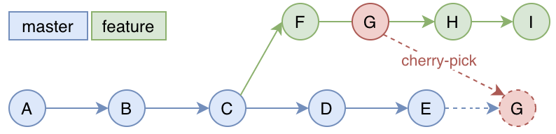

# git使用

## 合入部分commit



```shell
# 示例：
# 0. 切换到master分支（当前分支）
git checkout master
# 1. 将G合入当前分支
git cherry-pick G-Hash
# 2. 将F和G合入当前分支
git cherry-pick F-Hash G-Hash
# 3. 将F到H合入当前分支（包含F）
git cherry-pick F-Hash^..G-Hash
# 4. 将F到H合入当前分支（不包含F）
git cherry-pick F-Hash..G-Hash
# 5. 将I（feature最后一个commit）合入当前分支
#   方法1：使用分支名，表示最后一个提交
git cherry-pick feature
#   方法2： 使用I的hash
git cherry-pick I-Hash
```

> 参考：
> 1. <https://git-scm.com/docs/git-cherry-pick>
> 1. <http://www.ruanyifeng.com/blog/2020/04/git-cherry-pick.html>
