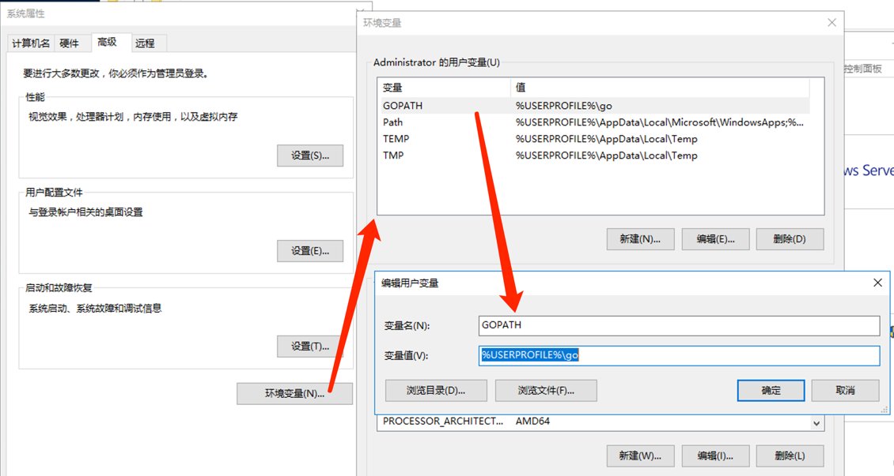

## Go 的安装、卸载及目录结构
### 官方指引（最新版）
   > [https://golang.org/doc/install](https://golang.org/doc/install)  
   > [https://golang.google.cn/doc/install](https://golang.google.cn/doc/install)

### 更多版本下载
   > [https://golang.org/dl/](https://golang.org/dl/)  
   > [https://golang.google.cn/dl/](https://golang.google.cn/dl/)

### Linux / Mac 上安装 Go

1. 配置环境变量
   ``` shell
   # GOROOT：golang的安装位置  
   export GOROOT=/usr/local/go
   export PATH=$PATH:$GOROOT/bin
   # GOPATH：项目的工作目录
   export GOPATH=$HOME/go
   export PATH=$PATH:$GOPATH/bin
   # sum验证服务
   #   国内：sum.golang.google.cn
   #   全球：sum.golang.org
   export GOSUMDB="sum.golang.google.cn"

   export GO111MODULE=on
   # GOPROXY：通该代理下载源代码（目的：加速）
   #  可选范围：
   #    七牛：https://goproxy.cn
   #    全球代理：https://goproxy.io
   #    阿里：https://mirrors.aliyun.com/goproxy/
   export GOPROXY=https://goproxy.cn
   ```
   说明：也可使用[自建的 goproxy](goproxy.md)
   
   配置文件：
    - bash: $HOME/.bashrc
    - zsh: $HOME/.zshrc
    - sh: $HOME/.profile
    
   golang官方docker镜像配置如下：
   > GOROOT=/usr/local/go  
   > GOPATH=/go

1. 安装（以1.16为例）
   
   Linux
    ```
    GOLANG_VERSION=1.16 && curl https://dl.google.com/go/go"${GOLANG_VERSION}".linux-amd64.tar.gz | tar -xzf - -C /usr/local
    ```
   Mac
    ```
    GOLANG_VERSION=1.16 && curl https://dl.google.com/go/go"${GOLANG_VERSION}".darwin-amd64.pkg -o go.pkg && open go.pkg
    ```

1. 新的配置方式（可替代环境变量中的配置）
   ```shell
   go env -w GOPROXY=https://mirrors.aliyun.com/goproxy/,https://goproxy.cn,https://goproxy.io,direct
   go env -w GO111MODULE=on
   go env -w GOSUMDB=sum.golang.google.cn
   ```

1. 验证安装
   ```shell
   go version
   go env
   ```

### 在 Windows 上安装 Go
1. 下载一键安装包
1. 双击，全程默认安装，安装包会自动设置GOPATH，并将%GOPATH%/bin目录加到%PATH%路径中
1. 验证
    ```
    C:\Users\Administrator>go version
    go version go1.16 windows/amd64
    C:\Users\Administrator>go env
    ...
    set GOHOSTOS=windows
    set GOOS=windows
    set GOPATH=C:\Users\Administrator\go
    set GOROOT=C:\Program Files\Go
    ```
1. 如果想要修改GOPATH，请修改windows环境变量
    

### 源码安装
> [https://golang.org/doc/install/source](https://golang.org/doc/install/source)  
> [https://golang.google.cn/doc/install/source](https://golang.google.cn/doc/install/source)


### 多版本安装
> [https://golang.org/doc/manage-install#installing-multiple](https://golang.org/doc/manage-install#installing-multiple)  
> [https://golang.google.cn/doc/manage-install#installing-multiple](https://golang.google.cn/doc/manage-install#installing-multiple)

安装过程（以1.10.7为例）
```
go get golang.org/dl/go1.10.7
go1.10.7 download
go1.10.7 version
go1.10.7 env GOROOT
```

## 卸载 Go
> [https://golang.org/doc/manage-install#uninstalling](https://golang.org/doc/manage-install#uninstalling)  
> [https://golang.google.cn/doc/manage-install#uninstalling](https://golang.google.cn/doc/manage-install#uninstalling)

### 从 Linux / macOS / FreeBSD 卸载
1. 删除 GOROOT目录 `rm -rf /usr/local/go`
1. 将 GOROOT / GOPATH / GO111MODULE/ GOPROXY 环境变量从profie文件中删除（参考安装的配置部分）
1. 将bin目录从PATH环境变量中删除（参考安装的配置部分）
1. Mac下还需要删除 `/etc/paths.d/go` 文件：`rm -f /etc/paths.d/go`

### 从 Windows 卸载
打开路径 `控制面板/所有控制面板项/程序和功能` 卸载 `Go Programing Language...` 程序


## 官方 Docker 镜像
> [https://hub.docker.com/_/golang](https://hub.docker.com/_/golang)


## 发布历史
- [golang.org/doc/devel/release.html](https://golang.org/doc/devel/release.html)
- [golang.google.cn/doc/devel/release.html](https://golang.google.cn/doc/devel/release.html)

## GOROOT 目录结构

- AUTHORS：官方作者清单
- CONTRIBUTING.md：加入贡献者队列的指导文件
- CONTRIBUTORS：第三方贡献者清单
- LICENSE：授权协议
- PATENTS：专利
- README.md：说明文件
- SECURITY.md：安全政策
- VERSION：golang版本
- favicon.ico：浏览器页签左边的图标
- robots.txt：主要用来控制各大搜索引擎爬虫的爬取规则
- /api：每个版本的API列表归档文件
- /doc：示例程序，代码工具，本地文档等，可离线查看
- /test：单元测试程序，通过查看测试程序可以学习到golang的用法和特性
- /bin：可执行文件，如：编译器，Go 工具
- /lib：文档模版
- /misc：包含与支持 Go 编辑器有关的配置文件以及 cgo 的示例
- /os_arch：包含标准库的包的对象文件（.a）
- /src：包含源代码构建脚本和标准库的包的完整源代码
- /src/cmd：包含 Go 和 C 的编译器和命令行脚本

## 链接

- [目录](README.md)
- 下一节：[集成开发环境](ide.md)